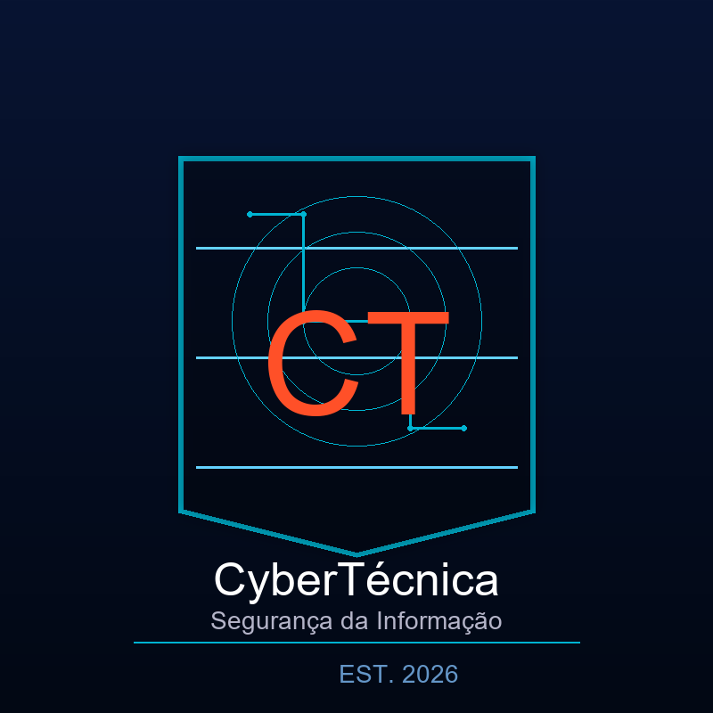

# 🏢 CyberTécnica LTDA – Laboratório de Cibersegurança

  

  <strong>Um laboratório corporativo de cibersegurança que simula uma empresa real com 3 andares, integrando segurança física e lógica.</strong>

  
  
  
  

---

## 🎯 Sobre o Projeto

O **CyberTécnica LTDA** é um laboratório portátil criado para simular uma empresa real de cibersegurança. Ele integra:

- **Segurança física**: modelagem 3D do prédio com 3 andares.
- **Segurança lógica**: redes, firewalls, ataques controlados e análise de tráfego.

Tudo rodando em um **HD externo portátil**, o que torna o ambiente replicável e demonstrável.

---

## 🏗️ Estrutura do Laboratório

| Andar        | Função                     | Tecnologias                     | IP            |
|--------------|----------------------------|--------------------------------|---------------|
| **Térreo**   | Recepção / Área Pública    | Ubuntu Server + Apache + PHP   | `192.168.18.29` |
| **1º Andar** | Infraestrutura / TI        | Windows 10 + Wireshark         | `192.168.18.30` |
| **2º Andar** *(planejado)* | Diretoria / SCIF | Windows 10 (futuro)            | `192.168.18.32` (futuro) |
| **Atacante** | Testes de segurança        | Kali Linux + Nmap              | `192.168.18.31` |

---

## ✅ Etapas Concluídas

### Infraestrutura Física e Virtual

- [x] HD externo de 465 GB formatado em exFAT (`LAB_CYBER`)
- [x] VirtualBox 7.2.8 instalado (versão estável)
- [x] Estrutura de pastas organizada

### Térreo – Recepção

- [x] Ubuntu Server com Apache2 + PHP
- [x] Formulário de pré‑cadastro de visitantes (nome, empresa, telefone, destino, motivo)
- [x] Design profissional com gradiente, sombras e responsividade

### 1º Andar – Infraestrutura / TI

- [x] Windows 10 instalado (chave KMS, sem ativação)
- [x] Firewall liberado para ICMP (`netsh advfirewall ...`)
- [x] Wireshark instalado e configurado
- [x] Ping funcional entre andares

### Atacante – Kali Linux

- [x] Rede Bridge configurada (IP `192.168.18.31`)
- [x] Nmap instalado e utilizado para:
  - Descoberta de rede (`nmap -sn 192.168.18.0/24`)
  - Escaneamento de portas no Ubuntu (porta 80) e Windows (SMB)
  - Teste de vulnerabilidade SMB (nenhuma crítica encontrada)
  - Detecção de sistema operacional (Windows 10 – 97% de precisão)

### Documentação e Portfólio

- [x] Repositório GitHub atualizado
- [x] README profissional com badges, tabelas e checklist
- [x] Pasta `screenshots/` com 21+ evidências
- [x] Documento `PROJECT_WALKTHROUGH.md` detalhado
- [x] Logomarca criada com Python (Pillow)
- [x] Site no GitHub Pages ([acessar](https://joaosolano.github.io/cybersecurity-corporate-lab/))

---

## 📸 Galeria de Evidências

As principais capturas de tela do laboratório estão disponíveis em:

📁 [`screenshots/`](screenshots/)

Ou visite a [página de evidências](https://joaosolano.github.io/cybersecurity-corporate-lab/evidencias) no site do projeto.

---

## 🛠️ Ferramentas e Tecnologias

| Categoria           | Ferramentas |
|---------------------|-------------|
| **Virtualização**   | VirtualBox, Guest Additions |
| **Sistemas**        | Kali Linux, Ubuntu Server, Windows 10 |
| **Rede**            | Bridge, NAT, ICMP, SMB, RPC |
| **Serviços**        | Apache2, PHP, Wireshark, Nmap |
| **Documentação**    | GitHub, Markdown, Python (Pillow) |
| **Modelagem 3D**    | FreeCAD (iniciado) |

---

## 🚀 Próximos Passos (Extrapolação)

### Lógica e Redes
- [ ] Configurar **pfSense** para isolar logicamente os 3 andares (VLANs, DMZ, Diretoria)
- [ ] Implementar **Metasploit** para simulação de ataques controlados
- [ ] Instalar **Snort/Suricata** como IDS/IPS no Ubuntu

### Física (Modelagem 3D)
- [ ] Modelar o prédio completo no **FreeCAD** com:
  - Térreo: recepção, catracas, câmeras
  - 1º andar: sala‑cofre, racks de servidores, armários blindados
  - 2º andar: diretoria, sala SCIF
- [ ] Importar/exportar **IFC** para interoperabilidade BIM

### Integração e Automação
- [ ] Painel administrativo para o formulário de visitantes (login, SQLite)
- [ ] Scripts Python para automatizar ataques e coletar logs
- [ ] Vídeo de demonstração do laboratório

---

## 👤 Autor

**João Solano**  
Pós‑graduando em Computação Forense e Perícia Digital – Unopar  
Criador do Laboratório CyberTécnica

---

## 📖 Documentação Completa

- [PROJECT_WALKTHROUGH.md](docs/PROJECT_WALKTHROUGH.md)
- [Manual de Boas Práticas](docs/manual_boas_praticas.md)

---

## 📄 Licença

Este projeto está sob a licença MIT. Consulte o arquivo [`LICENSE`](LICENSE) para mais informações.

---

**Última atualização:** Junho de 2026
