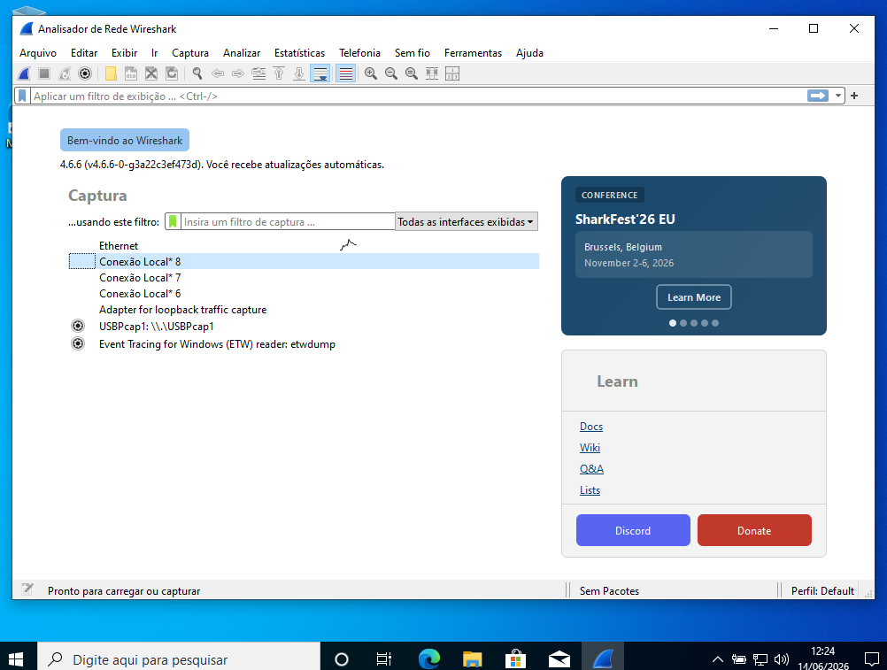
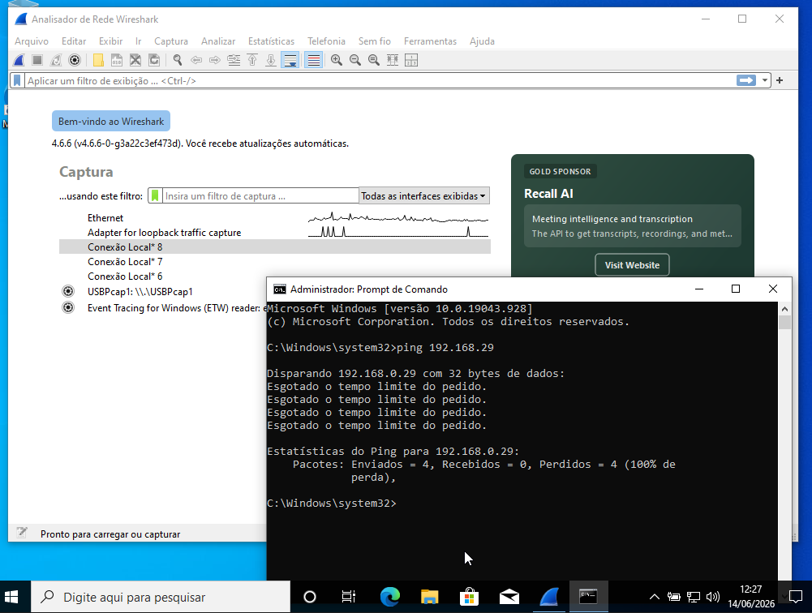
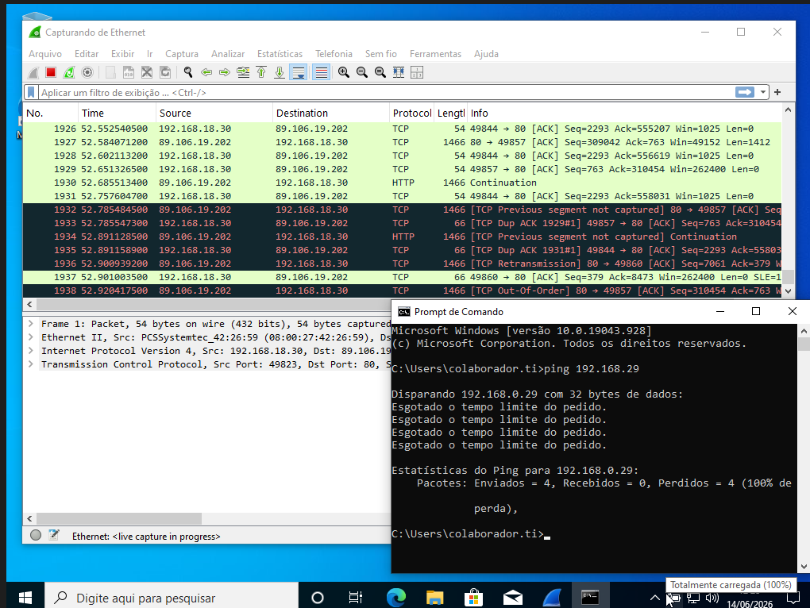
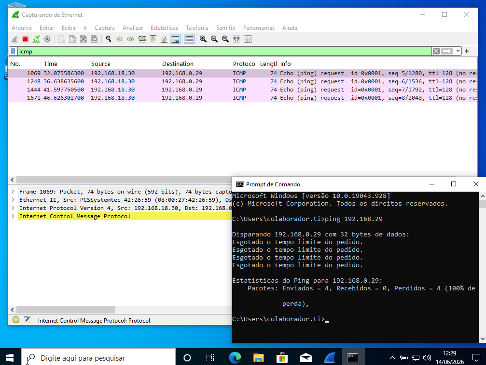
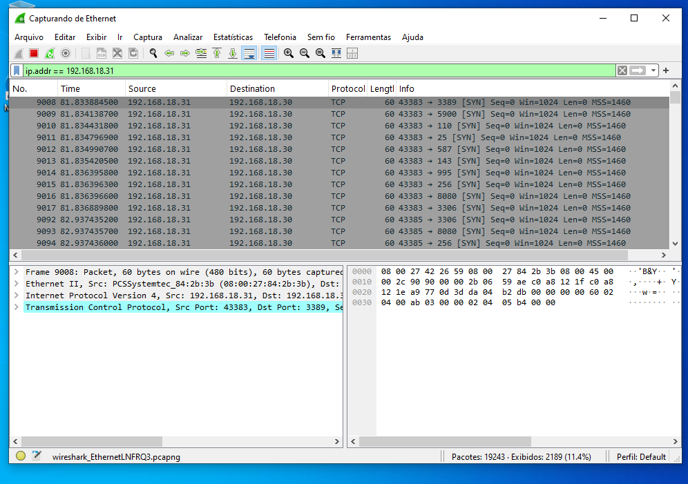
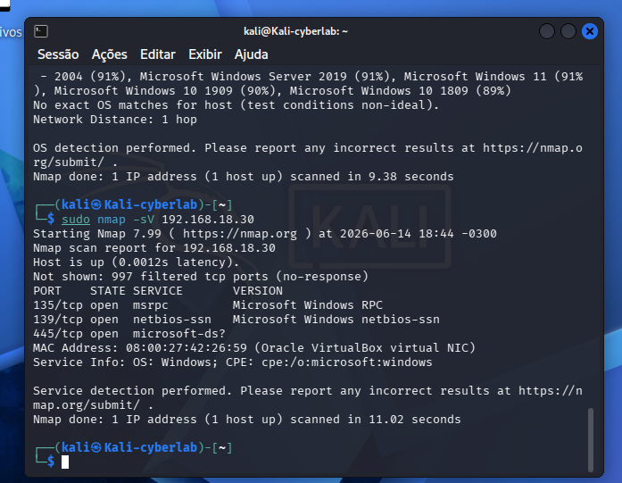

# 🏢 cybersecurity-corporate-lab

  

> Laboratório corporativo de cibersegurança simulando uma empresa real com 3 andares, segurança física e lógica integradas.

## 🎯 Sobre o Projeto

Este laboratório simula a **CyberTécnica LTDA**, uma empresa de cibersegurança com estrutura física de 3 andares:

| Andar | Função | Tecnologias | IP |
|-------|--------|-------------|-----|
| **Térreo** | Recepção / Público | Ubuntu Server + Apache + PHP | 192.168.18.29 |
| **1º Andar** | Infraestrutura / Servidores | Windows 10 + Wireshark | 192.168.18.30 |
| **Atacante** | Testes de segurança | Kali Linux | 192.168.18.31 |

## ✅ Passos já concluídos

### Infraestrutura
- [x] HD externo de 465GB formatado em exFAT
- [x] VirtualBox 7.2.8 instalado
- [x] Estrutura de pastas organizada

### Térreo (Recepção)
- [x] Ubuntu Server instalado
- [x] Apache + PHP configurados
- [x] Formulário de pré-cadastro de visitantes funcionando
- [x] Design profissional com CSS

### 1º Andar (Infraestrutura)
- [x] Windows 10 instalado
- [x] Rede Bridge configurada
- [x] Wireshark instalado e configurado
- [x] Firewall liberado para ping (ICMP)

### Atacante (Kali Linux)
- [x] Kali Linux instalado
- [x] Rede Bridge configurada
- [x] Nmap instalado
- [x] Testes de comunicação com Térreo e 1º Andar
- [x] Escaneamento de portas
- [x] Detecção de sistema operacional (Windows 10 - 97% de precisão)
- [x] Testes de vulnerabilidade SMB

## 📸 Evidências da Implementação

### Configuração do Laboratório

| Etapa | Screenshot |
|-------|------------|
| Estrutura de pastas do HD |  |
| VirtualBox com Kali |  |
| Kali Linux rodando |  |
| Comando whoami |  |
| Comando ip a |  |

### Térreo - Servidor Ubuntu (Recepção)

| Etapa | Screenshot |
|-------|------------|
| Login no Ubuntu Server |  |
| Apache instalado |  |
| Página padrão do Apache |  |
| Formulário da Recepção |  |
| Formulário preenchido |  |

### 1º Andar - Windows 10 (Infraestrutura)

| Etapa | Screenshot |
|-------|------------|
| Wireshark instalado |  |
| Wireshark capturando ping |  |
| Ping para o Térreo (Ubuntu) |  |
| Filtro ICMP aplicado |  |

### Atacante - Kali Linux (Testes de Segurança)

| Etapa | Screenshot |
|-------|------------|
| Ping para o Ubuntu (Térreo) |  |
| Ping para o Windows (1º Andar) |  |
| Escaneamento de rede |  |
| Escaneamento do Ubuntu (porta 80) |  |
| Escaneamento do Windows (SMB) |  |
| Teste de vulnerabilidade SMB |  |
| Detecção de SO (Windows 10 97%) |  |

## 🛠️ Técnicas e Ferramentas Utilizadas

| Categoria | Ferramentas | Técnicas |
|-----------|-------------|----------|
| **Virtualização** | VirtualBox | VMs portáteis em HD externo |
| **Sistemas** | Kali Linux, Ubuntu, Windows 10 | 3 andares interconectados |
| **Rede** | Bridge mode, NAT | Comunicação entre VMs |
| **Serviços** | Apache2, PHP | Site da recepção |
| **Análise** | Wireshark | Captura de pacotes ICMP, SYN/SYN-ACK |
| **Pentest** | Nmap | Escaneamento, detecção de SO, vulnerabilidades |

## 🚀 Próximos passos

- [ ] Configurar firewall pfSense (separar andares logicamente)
- [ ] Modelagem 3D do prédio no FreeCAD
- [ ] Simular ataques avançados (Metasploit)
- [ ] Configurar IDS/IPS (Snort/Suricata)

## 👤 Autor

**João Solano**

Projeto em desenvolvimento como parte do portfólio prático em cibersegurança.

🔗 [GitHub](https://github.com/joaosolano/cybersecurity-corporate-lab)
