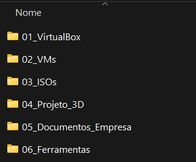
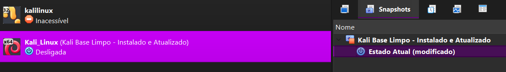
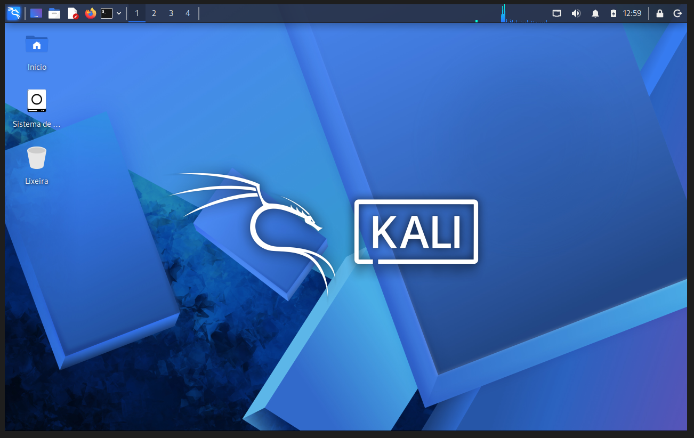
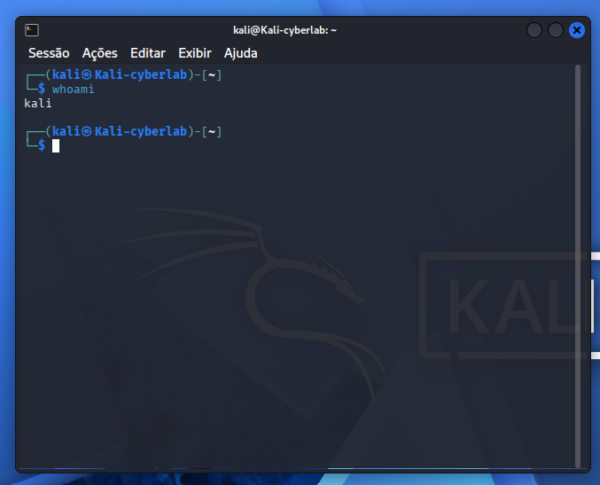
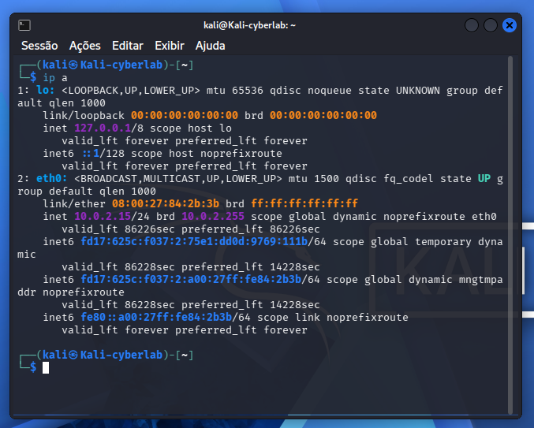
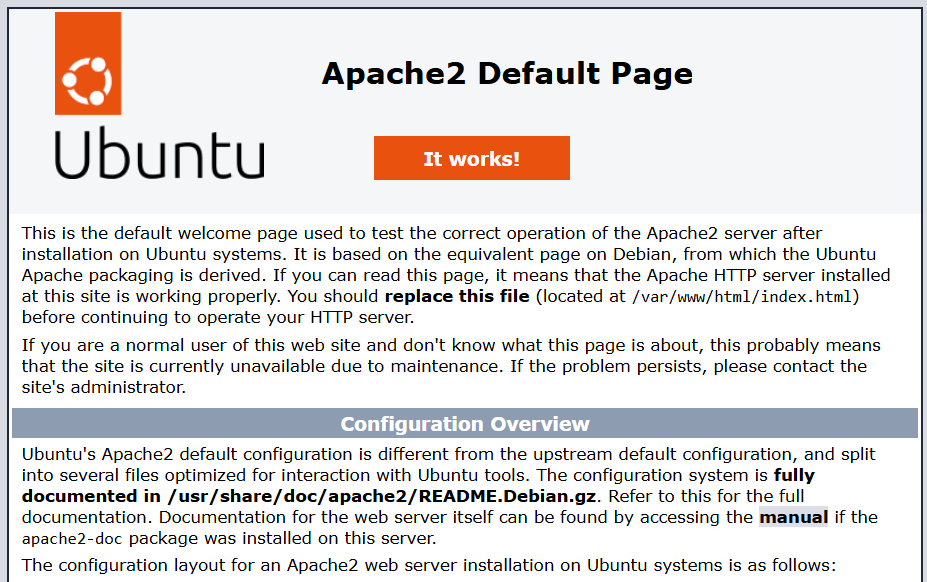
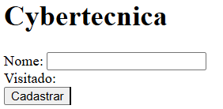
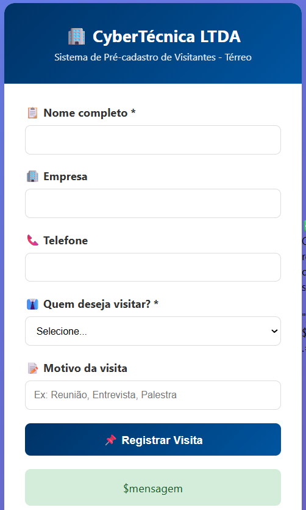
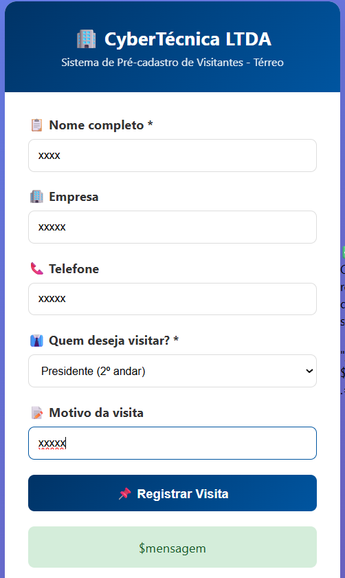

# 🏢 cybersecurity-corporate-lab

> Laboratório corporativo de cibersegurança simulando uma empresa real com 3 andares.

## ✅ Passos já concluídos

- [x] HD externo de 465GB formatado em exFAT
- [x] VirtualBox 7.2.8 instalado
- [x] Kali Linux instalado
- [x] Ubuntu Server (Recepção) instalado
- [x] Formulário de cadastro funcionando

## 📸 Evidências

### Configuração do Laboratório

| Etapa | Screenshot |
|-------|------------|
| Estrutura de pastas |  |
| VirtualBox |  |
| Kali Desktop |  |
| Comando whoami |  |
| Comando ip a |  |

### Servidor da Recepção (Térreo)

| Etapa | Screenshot |
|-------|------------|
| Página padrão Apache |  |
| Formulário funcionando |  |
| Formulário bonito vazio |  |
| Formulário preenchido |  |

## 🚀 Próximos passos

- [ ] Instalar Windows 10 (1º Andar)
- [ ] Configurar pfSense (Firewall)

## 👤 Autor

🔗 [GitHub](https://github.com/joaosolano/cybersecurity-corporate-lab)
