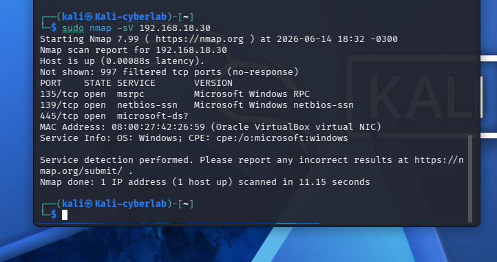
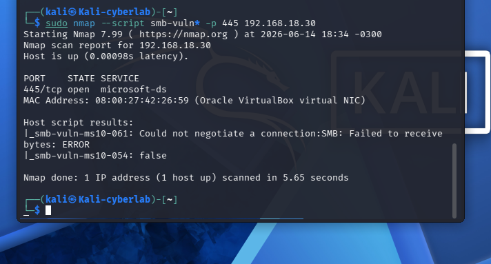

## 📸 Evidências dos Testes de Rede

| Descrição | Imagem |
|-----------|--------|
| Ping para o Windows (1º Andar) |  |
| Ping para o Ubuntu (Térreo) |  |
| Escaneamento de rede |  |
| Escaneamento do Ubuntu (porta 80) |  |
| Escaneamento do Windows (SMB) |  |
| Teste de vulnerabilidade SMB |  |
| Detecção de SO (Windows 10 97%) |  |
