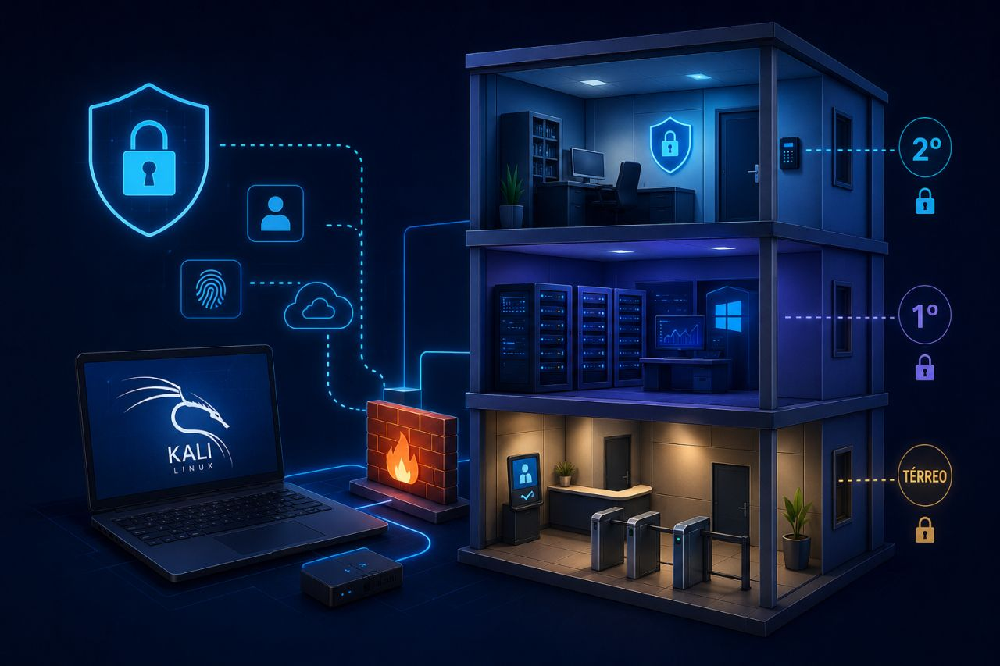

<h1 align="center">🏛️ CyberTécnica LTDA – Laboratório de Cibersegurança</h1>

  

  <strong>🔐 Segurança que se ensina, se testa e se vive.</strong>

<!-- === BADGES - TECNOLOGIAS === -->

  
  
  
  
  
  
  
  
  
  

<!-- === BADGES - STATUS E ESTATÍSTICAS === -->

  
  
  
  
  
  
  
  
  

<!-- === BADGES - REDES SOCIAIS === -->

  
  

---

<!-- === IMAGEM DO PROJETO === -->

  

---

## 🎯 Sobre o Projeto

Bem-vindo ao repositório do **CyberTécnica**, um laboratório corporativo de cibersegurança que integra segurança física e lógica em um ambiente portátil.

Este laboratório simula uma empresa real com 3 andares (Recepção, Infraestrutura e Diretoria), utilizando VirtualBox, Kali Linux, Ubuntu Server, Windows 10, Wireshark, Nmap, pfSense e muito mais.

---

## 🌟 Diferenciais do CyberTécnica

- **Portátil** – roda em um HD externo, pronto para qualquer computador.
- **Integrado** – une segurança física (modelagem 3D) e lógica (redes, firewalls).
- **Documentado** – cada passo registrado com prints, comandos e desafios superados.
- **Aplicável** – casos reais como preservação forense, testes de rede e análise de vulnerabilidades.

---

## 📊 Status do Projeto

| Área | Status |
|------|--------|
| Infraestrutura (3 VMs) | ✅ Concluído |
| Documentação | ✅ Concluído |
| Site GitHub Pages | ✅ Concluído |
| Manual de Boas Práticas | ✅ Concluído |
| Página de Cursos | ✅ Concluído |
| Preservação Forense | ✅ Concluído |
| **pfSense / Firewall** | ✅ Concluído |
| Modelagem 3D | ⏳ Planejado |

---

## 🔐 Casos Práticos

- [Caso Pendrive-Cofre com VeraCrypt](cofre_digital.html) – preservação forense, criptografia AES-256, documentação completa com hashes e desafios superados.

---

## 🧰 Tecnologias Utilizadas

- VirtualBox, Kali Linux, Ubuntu Server, Windows 10
- Wireshark, Nmap, pfSense, FTK Imager
- Python (Pillow, OpenAI API)
- FreeCAD (modelagem 3D)

---

## 📚 Navegação

- [🏠 Página Inicial](index.html)
- [📸 Evidências](evidencias.html)
- [👤 Sobre o Autor](sobre.html)
- [📄 Cursos](cursos.html)
- [📘 Manual de Boas Práticas](manual_boas_praticas.html)
- [📄 Walkthrough](PROJECT_WALKTHROUGH.html)
- [📄 Relatório de Incidente CT-SIRT-001](RELATORIO_INCIDENTE_CT-SIRT-001.html)
- [🔐 Caso Pendrive-Cofre com VeraCrypt](cofre_digital.html)
- [🔥 pfSense / Firewall](pfsense.html)

---

📎 [Repositório no GitHub](https://github.com/joaosolano/cybersecurity-corporate-lab)
